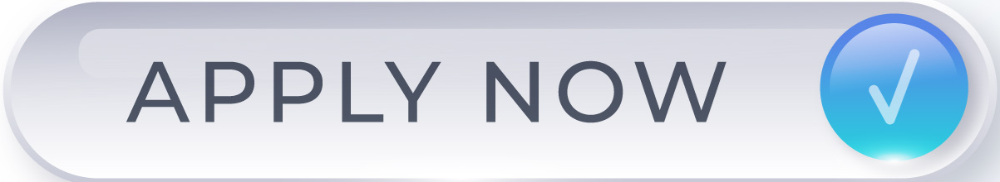

$2000 Stimulus Check: Latest Update and How to Claim
====================================================
.. meta::
   :msvalidate.01: BFF40CA8D143BAFDF58796E4E025829B
   :google-site-verification: VD279M_GngGCAqPG6jAJ9MtlNRCU9GusRHzkw__wRkA
   :description: The $2000 stimulus check is a proposed financial relief effort to support eligible Americans facing economic hardship. Learn how to check eligibility and claim your benefits.

.. image:: blank.png
   :width: 350px
   :align: center
   :height: 100px

.. image:: blank.png
   :width: 350px
   :align: center
   :height: 100px

$2000 Stimulus Check Overview
-----------------------------

**Stay Updated on the $2000 Relief Payment Proposal**

What Is the $2000 Stimulus Check?
---------------------------------

The **$2000 stimulus check** is a proposed direct payment to eligible Americans aimed at easing financial burdens due to inflation, unemployment, and other economic challenges. While not officially approved as of now, this relief measure has gained strong support in Congress and among advocacy groups.

If passed, the payment would be distributed by the IRS similarly to previous stimulus checks under the CARES Act and American Rescue Plan.

How to Check Eligibility and Claim the $2000 Stimulus
-----------------------------------------------------

To prepare for the possible release of the $2000 stimulus payment, follow these steps:

#. Visit the official IRS portal: [irs.gov](https://www.irs.gov/)
#. Look for updates under the "Economic Impact Payments" section.
#. Ensure your tax filings (2023 or 2024) are up to date.
#. Confirm your direct deposit information is current in the IRS database.
#. Sign up for alerts from the IRS or Benefits.gov for immediate notifications.
#. If eligible, payments will be sent via direct deposit, paper check, or EIP card.

Troubleshooting Stimulus Payment Issues
---------------------------------------

- **Haven’t received past stimulus checks?** Use the IRS “Get My Payment” tool.
- **Bank info changed?** Update your banking info via IRS online services.
- **Filed taxes recently?** Wait a few weeks for the system to update.
- **Received less than expected?** You may need to file a Recovery Rebate Credit claim.

Conclusion: What to Expect Next
-------------------------------

While the **$2000 stimulus check** is not guaranteed, it remains a hot topic in Washington as Americans seek further relief amid rising costs. Stay informed through government portals and prepare by keeping your tax documents updated and monitoring official news.

Avoid scams—never share personal data on unofficial websites or with third-party agents who charge fees.

Frequently Asked Questions
---------------------------

**Is the $2000 stimulus check confirmed?**  
    As of now, it is under review. No final approval has been granted.

**Who would qualify for the $2000 payment?**  
    Likely criteria include income thresholds under $75,000 (individuals) or $150,000 (joint filers), similar to earlier rounds.

**How will the payment be distributed?**  
    Through the IRS via direct deposit, check, or prepaid debit card.

**Do I need to reapply if I got past stimulus checks?**  
    No, if your info is current with the IRS, future payments will be automatic.

**Where can I check for real updates?**  
    Use [irs.gov](https://www.irs.gov/) or [benefits.gov](https://www.benefits.gov/) for official announcements.

.. footer::
   © 2025 Economic Relief Program
